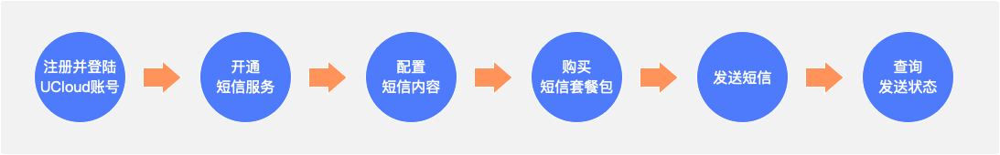

# 快速入门

**1.注册并登陆UCloud账号**

- 注册UCloud账号：[点击快速注册](https://passport.ucloud.cn/#register) 或 直接联系您的客户经理

- 账号实名认证：[点击账号实名认证](https://console.ucloud.cn/uaccount/authentication)

**2.开通短信服务**

- 点击阅读并同意《[UCloud短信服务开通协议](https://docs.ucloud.cn/usms/introduction/service_level)》
- 登陆短信服务首页免费开通（首次访问后免费开通）：[访问USMS短信服务控制台](https://console.ucloud.cn/usms) 

**3.配置短信内容**

短信内容由短信签名、短信正文两部分组成，其中，短信正文在发送时调用对应的短信模板ID及变量来实现信息传递；短信签名、短信模板均需要在发送前进行申请，并通过平台审核；

- **申请短信签名**：短信签名一般放在短信正文前面，用于标识企业主体或产品业务，申请时需提供相应资质材料，[点击申请短信签名](https://console.ucloud.cn/usms/domestic)；
- **申请短信模板**：短信模板是要发送的短信内容的重要组成部分，按文案区分为验证码、通知通知、会员营销，[点击申请短信模板](https://console.ucloud.cn/usms/domestic)；

**4.购买短信套餐包**

已完成实名认证的账号可以使用赠金购买适量的短信套餐包进行测试；

- 购买短信套餐包：[点击购买国内短信](https://console.ucloud.cn/usms?package_type=0&purpose=1&buy_amount=50) 、[点击购买国际及港澳台短信](https://console.ucloud.cn/usms?package_type=0&purpose=0&buy_amount=10&buy_country=HK) 

**5.发送短信**

建议先通过页面 web群发工具 或 模拟API接口 方式调用进行发送测试，调用成功后在对接API或SDK进行联调

- 通过 **Web群发工具** 模拟发送短信：[点击使用 Web群发工具 ](https://console.ucloud.cn/usms?package_type=0&purpose=1&buy_amount=50) 
- 通过**页面模拟API接口** 模拟发送短信：[点击使用 开放API调用工具 ](https://console.ucloud.cn/uapi/detail?id=SendUSMSMessage) 
- 通过**对接发送API或SDK** 模拟发送短信：[API接口文档 ](https://docs.ucloud.cn/usms/api_docs/9001) 、[SDK文档 ](https://console.ucloud.cn/usms/config) 

**6.查询发送状态**

短信发送后可以通过如下几种方式查询发送状态信息：

- 通过 发送详情页 查询：[点击查询 发送状态信息](https://console.ucloud.cn/usms?package_type=0&purpose=1&buy_amount=50) 
- 通过对接 状态报告查询API或SDK 查询：[API接口文档 ](https://docs.ucloud.cn/usms/api_docs/9001) 、[SDK文档 ](https://console.ucloud.cn/usms/config) 
- 通过 配置回调地址 接收发送状态信息：[状态报告回调文档](https://docs.ucloud.cn/usms/api_docs/ret_message/retStatus)

