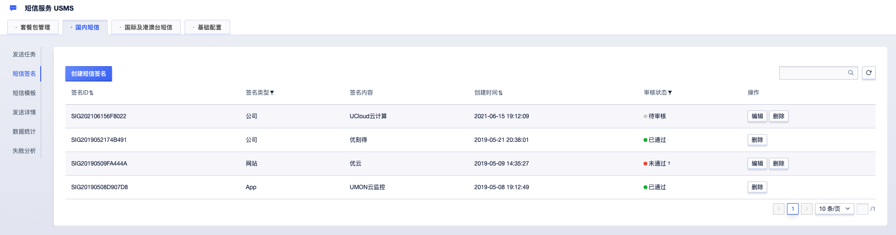

# 短信签名

## 一、短信签名管理

在短信服务USMS的国内短信页/短信签名Tab页，默认展示当前项目下、申请过的各短信签名，主要信息包括：

  - **短信签名ID**：由系统生成的短信签名编号，当有短信签名相关问题或咨询服务时，您可同时提交该编号，将加速处理进展；
  - **签名类型**：根据您的签名用途和提交的材料，区分为公司、APP、网站、小程序、商标、政府/机关事业单位/其他机构等；
  - **签名内容**：根据您的签名用途和提交的材料，由您自主申请，但需符合相关标准（详见：[签名审核标准](usms/introduction/2005/2103)）
  - **创建时间**：您短信签名提交申请的时间；
  - **审核状态**：根据审核进度实时更新进展，分位待审核、审核中、已通过、未通过；

您可对已申请的签名进行管理维护，其中，待审核、审核中、未通过状态的短信签名可重新编辑，修改后的签名再次提交会重新送审；未通过审核的短信签名，系统会反馈您具体的审核结果；

## 二、自助申请短信签名

### 2.1）提交相应申请材料

在短信服务USMS的国内短信/短信签名Tab页，点击列表左上角的“创建短信签名”按钮，跳转到“短信签名申请页”，可按需提交相关材料申请签名，说明如下：

  - **签名类型**：您可以根据您申请的短信签名用途及待提交的审核材料，选择相应的签名类型；
  - **签名内容**：您可以根据您申请的短信签名用途及待提交的审核材料，自行填写，审核标准详见：[签名审核标准](usms/introduction/2005/2103)；
  - **审核材料**：您可以根据您申请的短信签名用途，提交相应的审核材料，审核标准详见：[签名审核标准](usms/introduction/2005/2103)；
  - **签名用途**：分为自用、他用，默认“自用”；若您的签名是供他人使用，需提交授权委托书，详见：[签名审核标准](usms/introduction/2005/2103)；

### 2.2）签名审核进展及结果

  - **审核时间**：09:00 - 23:00，法定节假日顺延，建议您尽量在19:00前提交申请；
  - **审核进展**：短信签名一般在申请提交后的2小时内完成审核，并会给您反馈审核结果；
  - **紧急申请**：若您急需使用已提交申请的短信签名，可提交工单或直接联系我们
    [技术支持](https://www.ucloud.cn/site/service.html)，我们会加速审核进度；
  - **审核结果**：当且仅当您的短信签名的审核状态为“**已通过**”后，您才可正常使用该短信签名；
