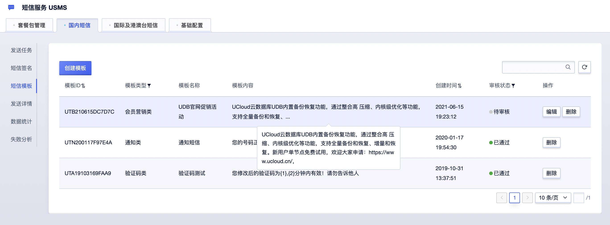
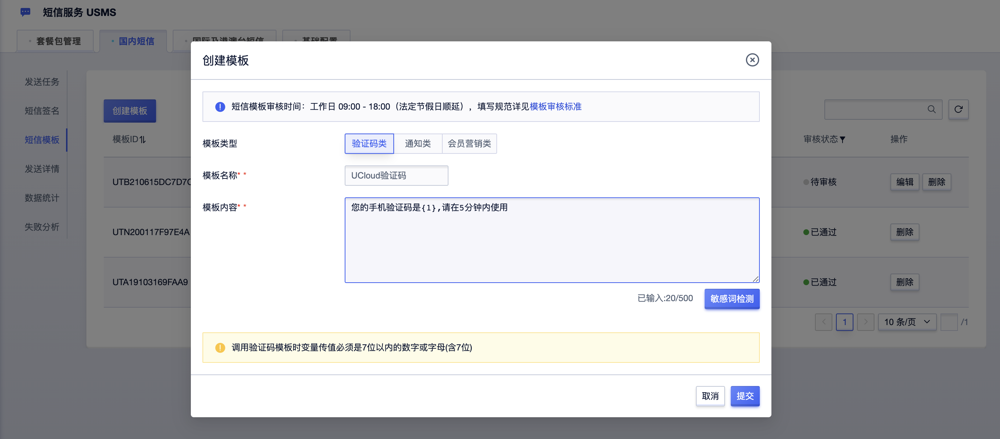

# 短信模板

## 一、短信模板管理

在短信服务USMS的国内短信/短信模板Tab页，默认展示当前项目下、申请过的各短信模板，主要信息包括：

  - **短信模板ID**：由系统生成的短信模板ID，当有短信模板相关问题或咨询服务时，您可同时提交该ID号，将加速处理进展；
  - **模板类型**：根据您的短信用途，区分为验证码类、系统通知类和营销推广类短信模板；
  - **模板名称**：您可以自行填写，但需符合相关标准（详见：[模板审核标准](usms/introduction/2005/2105)）
  - **模板内容**：根据您的短信用途，由您自主申请，但需符合相关标准（详见：[模板审核标准](usms/introduction/2005/2105)）
  - **创建时间**：您的短信模板提交申请的时间；
  - **审核状态**：根据审核进度实时更新进展，包括：待审核、审核中、已通过、未通过；

您可对已申请的短信模板进行管理维护，其中，待审核、审核中、未通过状态的短信模板可进行重新编辑，修改后的签名再次提交会重新送审；未通过审核的短信模板，系统会实时反馈您具体的审核结果；

## 二、自助申请短信模板

### 2.1）填写短信模板信息

在短信服务USMS的 国内短信/短信模板Tab页，点击列表左上角的“创建模板”按钮，跳转到“短信模板申请页”，可按需填写相关信息，说明如下：

  - **模板类型**：根据您的短信用途，区分为验证码类、系统通知类和营销推广类短信模板；
  - **模板名称**：您可以自行填写，但需符合相关标准（详见：[模板审核标准](usms/introduction/2005/2105)）
  - **模板内容**：根据您的短信用途，由您自主申请，但需符合相关标准（详见：[模板审核标准](usms/introduction/2005/2105)）

### 2.2）敏感词检测（自助）

您可自助点击“敏感词检测”按钮进行自助检测，该检测结果仅供您参考，短信模板提交后将重新进行审核；

### 2.3）模板审核进展及结果

  - **审核时间**：09:00 - 18:00，法定节假日顺延，建议您尽量在17:00前提交申请；
  - **审核进展**：短信模板一般在申请提交后的1个工作日内完成审核，并会给您反馈审核结果；
  - **紧急申请**：若您急需使用已提交申请的短信模板，可提交工单或直接联系我们 技术支持，我们会加速审核进度；
  - **审核结果**：当且仅当您的短信模板的审核状态为“**已通过**”后，您才可正常使用该短信模板；
