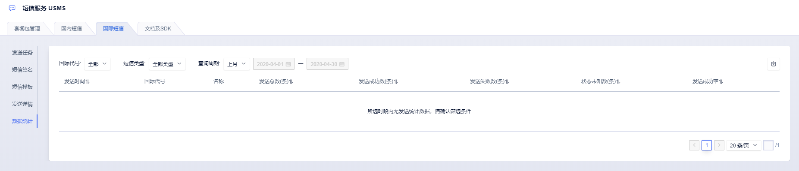

# 发送数据统计

> USMS短信服务提供以天为单位的发送数据统计，您可以在短信服务USMS的国际短信菜单页，选择“数据统计”二级菜单，支持按照短信类型、统计周期等维度来查询国际短信统计数据。

## 一、国际发送数据统计

在【国内短信 \ 数据统计】页面，您可以选择具体的短信类型精确筛选查看最近7天、最近15天、上个月或指定时间段的短信发送统计数据。

- 发送数据统计按照T-1模式，支持查询截止前一天的发送数据，不支持当天或实时发送数据统计；
- 发送数据统计以天为单位，统计当天的目标国际/地区、短信发送总数、发送成功数、发送失败数、状态未知数及发送成功率；
- 支持以Excel格式导出指定日期区间的发送数据统计结果（点击页面右上角导出按钮）；

**注释：**

1. 发送数据统计为当前账号项目下所有的发送状态统计，也包含运营商黑名单、停机、空号等各类手机终端原因导致的发送数据。
2. 发送数据统计结果中，发送条数为运营商实际的计费条数。

