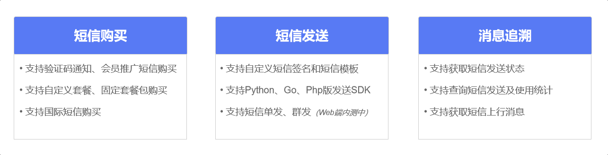
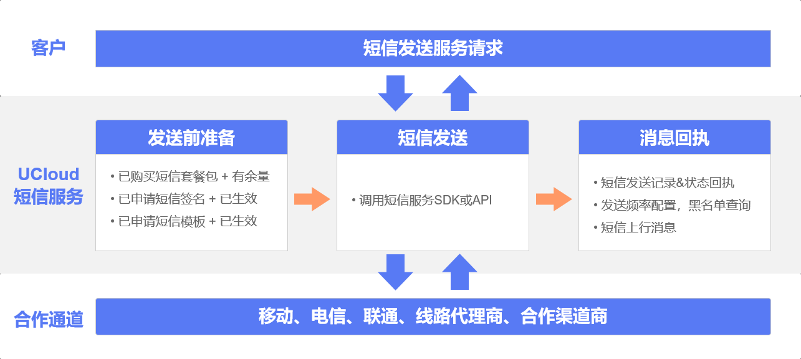

# 什么是短信服务

## 产品概述

USMS短信服务（Short Message Service）是UCloud为用户提供的一种云通信服务，帮助广大开发者便捷、灵活接入高质量的短信服务。

支持国内短信、国际及港澳台短信，其中，国际及港澳台短信覆盖全球200+国家及地区。常见应用场景：验证码短信（账号注册、登录验证、找回密码、安全提醒等场景），系统通知短信（故障告警、状态提醒、价格调整等场景），会员服务短信（活动通知、业务促销、新品上线、会员关怀等场景）。

## 产品功能

## 使用流程

