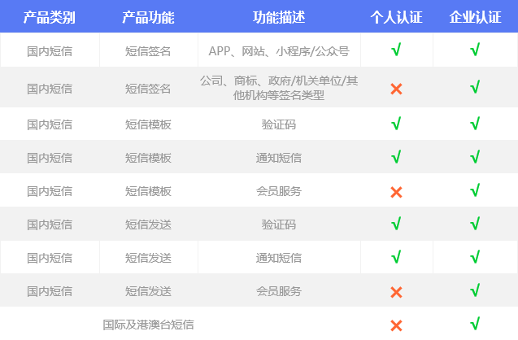

# 认证类型及权益

## 账号认证类型

UCloud实名认证分为个人实名认证和企业实名认证

  - **个人实名认证**：表示该账号使用者为个人用户。

  - **企业实名认证**：表示该账号使用者为企业用户，企业用户可以是企业、政府、事业单位、团体或组织。

关于账号实名认证的更多信息和操作，详见[账号认证](/account/identity_verification/index)。

USMS短信服务的部分功能（具体说明，详见 *下述*）仅对企业实名认证用户开放，如您需使用该部分功能，建议您将账号升级到企业实名认证。

## 个人认证和企业认证的权益区别

