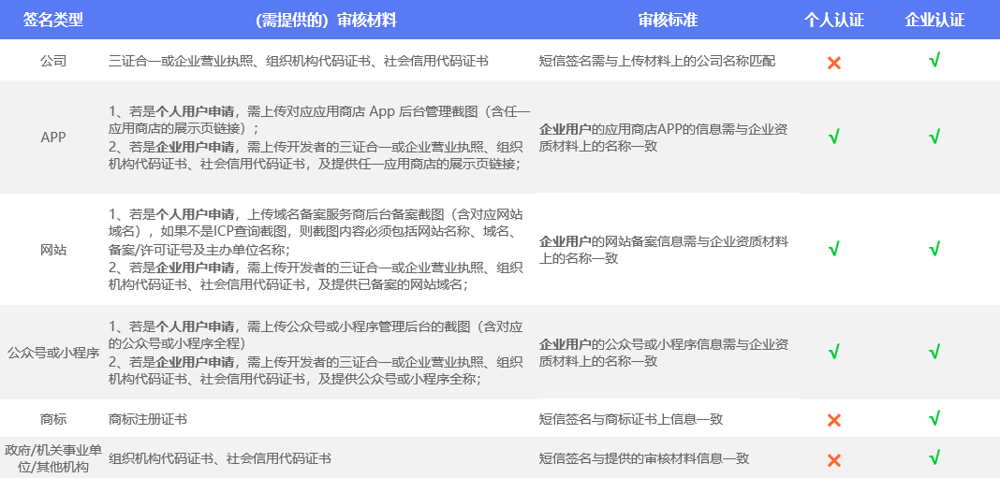

# 签名审核标准

{{indexmenu_n>3}}

## 签名内容规范

| 类别     | 规范说明                                                     |
| -------- | ------------------------------------------------------------ |
| 签名内容 | 1. 签名内容需与短信发送者提交的签名类型材料及用途相符合； 2. 签名内容必须用于标识所属公司、产品或业务，能够作为短信发送者的身份标识； 3. 签名内容必须具有实际意义，不支持中性化签名，如“告警通知”、“尊敬的客户”等； 4. 签名内容不得含有黄赌毒、党政、宗教及[UCloud短信服务协议](/management_monitor/usms/introduction/service_level)中严禁发送的内容等信息； 5. 若签名内容侵犯到第三方权益，必须获得第三方的授权； 6. 签名内容由中英文、数字或下划线组成，不得含有其他特殊符号； |
| 签名长度 | 1. 签名长度为2-12个字符，其中中英文、数字及下划线均作为一个字符统计； |
| 签名格式 | 1. **国内短信签名格式**：由【】及签名内容组成，申请时直接填写签名内容即可，发送时系统会自动加上【】； 2. **国际短信签名格式**：由[]及签名内容组成，申请时直接填写签名内容即可，发送时系统会自动加上[]； |

## 签名类型及审核材料

签名类型及对应需提交的审核材料，说明如下：

**注：**

  - 与证明文件相关的审核材料必须为原件扫描件，执照未过期并且未有任何涂改；
  - 上传的审核材料必须为jpg、png、pdf格式的文件，文件大小不超过4M；

## 签名用途规范

| **签名用途** | **规范说明**         | **审核标准**                     |
| -------- | ---------------- | ---------------------------- |
| 他用       | 需另外再提供原有企业的授权委托书 | 授权委托书已生效，并且标注的信息与提交的签名信息保持一致 |
| 自用       | 无需提供额外审核材料       |                              |

***注**：授权委托书样例 [短信签名-授权委托书](http://usms-static-file.cn-sh2.ufileos.com/%E7%9F%AD%E4%BF%A1%E6%9C%8D%E5%8A%A1USMS_%E6%8E%88%E6%9D%83%E5%A7%94%E6%89%98%E4%B9%A6_%E6%A0%B7%E5%BC%A0.doc)

## 其他说明

1、国际短信涉及到部分审核材料有差异，可提交工单或直接联系
[技术支持](https://www.ucloud.cn/site/service.html)。